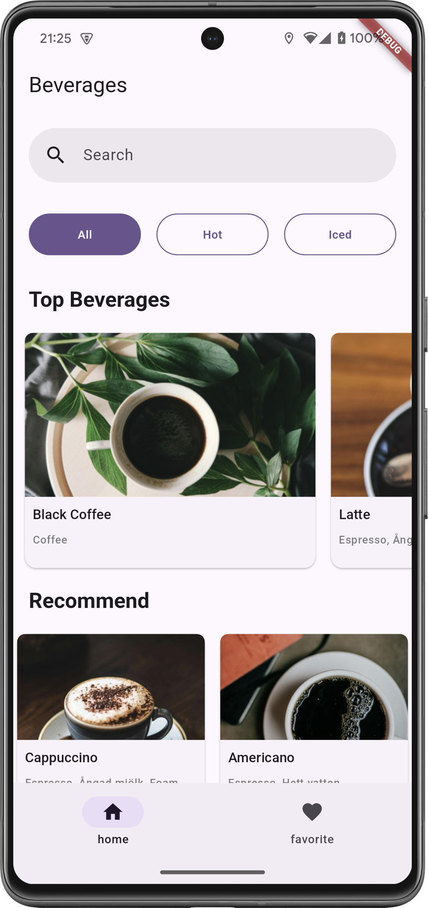

# Flutter Brew

Flutter Brew is a Flutter application that displays a list of beverages. 



## Features

- Display a list of beverages
- Show details of each beverage
- Unit tests for the beverage model
- Widget tests for the beverage list

## Getting Started

### Prerequisites

- Flutter SDK
- Dart SDK

### Installation

1. Clone the repository:
    ```sh
    git clone https://github.com/yourusername/flutter_brew.git
    ```
2. Navigate to the project directory:
    ```sh
    cd flutter_brew
    ```
3. Install the dependencies:
    ```sh
    flutter pub get
    ```

### Running the App

To run the app on an emulator or physical device, use the following command:
```sh
flutter run