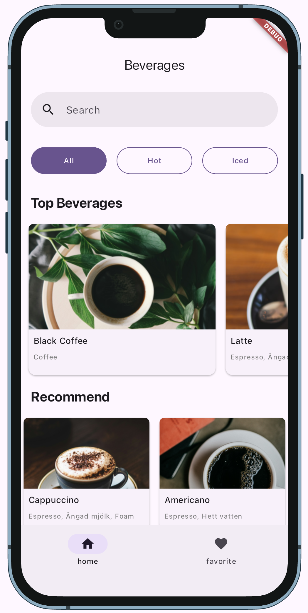

# Flutter Brew

Flutter Brew is a Flutter application that displays a list of beverages. 

| Android | iOS |
| --- | --- |
|  |  |

## Architecture

Architecture is Layered Architecture pattern. The app follows the [Flutter Architecture Guild](https://docs.flutter.dev/app-architecture/guide). The UI Layer is separated from the Data Layer. The UI Layer consists of the screens that display the beverages. The Data Layer consists of the repository that provides the beverages to the UI Layer.


## Features

- Display a list of beverages
- Show details of each beverage
- Search for beverages
- Favorite a beverage
- Filter beverages by category

## Technologies

- riverpod
- Mockito
- freezed
- retrofit
- isar
- go router
- get it
- Widget Book


## Getting Started

### Prerequisites

- Flutter SDK
- Dart SDK

### Installation

1. Clone the repository:
    ```sh
    git clone https://github.com/yourusername/flutter_brew.git
    ```
2. Navigate to the project directory:
    ```sh
    cd flutter_brew
    ```
3. Install the dependencies:
    ```sh
    flutter pub get
    ```

### Running the App

To run the app on an emulator or physical device, use the following command:
```sh
flutter run
```

### Running the Tests

To run the unit tests, use the following command:
```sh
flutter test
```

### Widget Book

To run the widget book, use the following command:
```sh
flutter run -d chrome -t lib/widgetbook.dart
```
